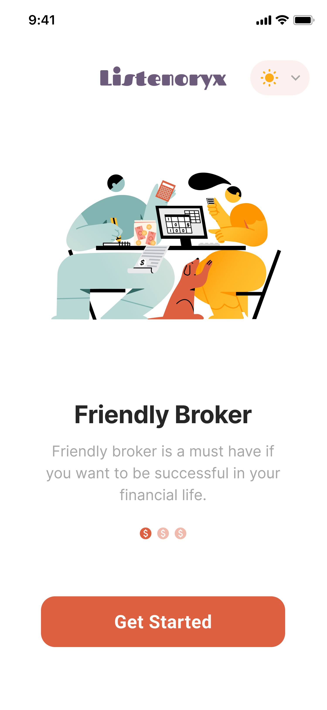
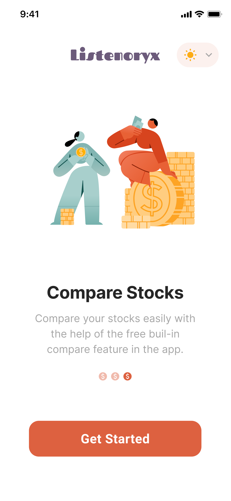
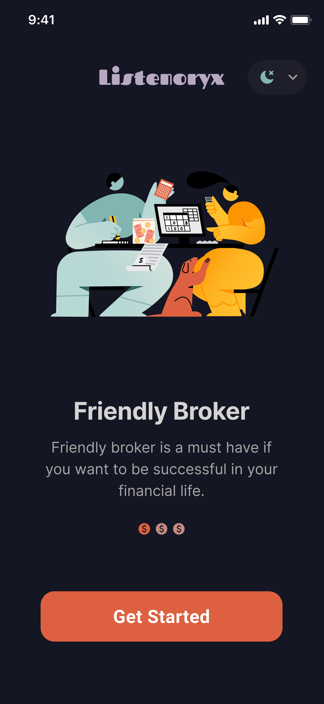
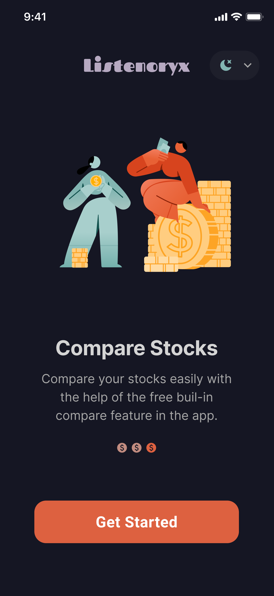
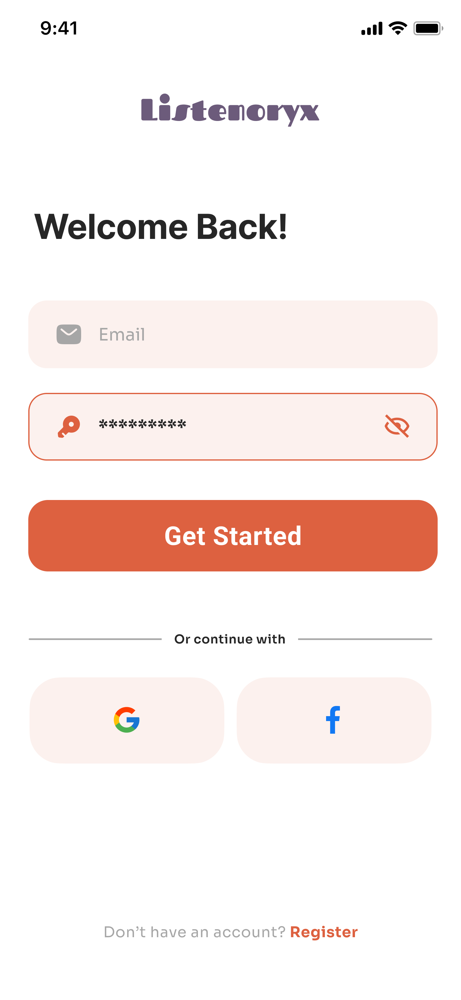
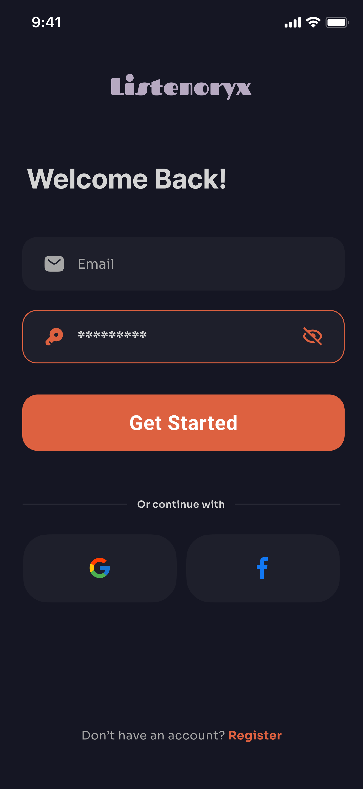

# Flutter UI Practice – Authentication & Onboarding

A small Flutter UI project created to practice:

- Flutter widgets & layout
- Theming and styling
- Clean file structure
- Reusable UI components

---

## 📌 Project Goals

- Practice building clean UI screens using Flutter
- Improve widget composition and reuse
- Apply consistent themes and styles

---

## 🛠 Tools Used

- Flutter
- Material 3
- Custom theme & reusable widgets

---

## 🎨 UI Screens

### Onboarding - Light mode

  

### Onboarding - Dark mode

  

### Authentication

 

---

## 🎨 Design Attribution

Design inspired by a Figma Community file created by Salman.
This project is not intended for commercial use.

---

## 🧱 Project Structure

```text
lib/
├── core/
│   ├── theme/
│   ├── constants/
│   └── utils/
│
├── features/
│   ├── onboarding/
│   │   ├── screens/
│   │   └── widgets/
│   │
│   └── auth/
│       ├── screens/
│       └── widgets/
│
├── shared/
│   └── widgets/
│
├── app.dart
└── main.dart
```

---

## 📖 Notes

- features/ contains all UI screens grouped by feature
- core/ holds app-wide styles and constants
- shared/widgets/ contains reusable components